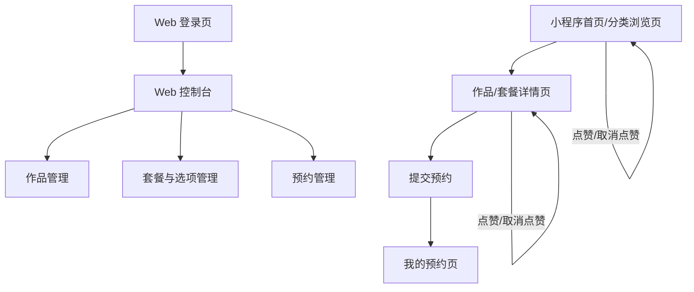

## 1. Product Overview
面向摄影师的微信小程序，用于展示作品与服务套餐，并支持可加减价的套餐选项、在线预约与点赞。
配套一个独立 Web 管理端（账号密码登录、可公网访问）用于内容与预约管理；数据存储使用微信云开发。

## 2. Core Features

### 2.1 User Roles
| 角色 | 注册/登录方式 | 核心权限 |
|------|---------------|----------|
| 小程序访客/客户 | 无显式注册；使用微信小程序用户身份（openid）识别点赞与预约 | 浏览作品与套餐、选择套餐选项加减价、提交预约、对作品/套餐点赞、查看自己的预约记录 |
| 管理员（Web） | 账号密码登录 | 管理分类、作品、套餐与可选项、预约单处理、基础数据维护 |

### 2.2 Feature Module
本产品由以下主要页面构成：
1. **小程序首页/分类浏览页**：分类入口（毕业照/写真照/婚纱照/场地租赁）、作品/套餐列表、筛选与排序、卡片快速点赞。
2. **作品/套餐详情页**：作品图集或套餐说明、可选项（可替换/加价/减价）、价格实时计算、预约表单提交、点赞。
3. **我的预约页**：预约记录列表、预约详情（时间/地点/备注/状态）。
4. **Web 管理端登录页**：账号密码登录、退出登录。
5. **Web 管理端控制台**：作品管理、套餐与选项管理、预约管理。

### 2.3 Page Details
| Page Name | Module Name | Feature description |
|-----------|-------------|---------------------|
| 小程序首页/分类浏览页 | 分类入口 | 展示固定分类：毕业照/写真照/婚纱照/场地租赁；点击进入对应列表 |
| 小程序首页/分类浏览页 | 列表展示 | 展示作品与套餐卡片（封面、标题、起价/价格、点赞数）；支持分页加载 |
| 小程序首页/分类浏览页 | 筛选/排序 | 按“作品/套餐”类型筛选；按最新/最热排序 |
| 小程序首页/分类浏览页 | 快速点赞 | 在列表卡片上对作品/套餐点赞/取消点赞（基于openid去重） |
| 作品/套餐详情页 | 内容展示 | 展示图集（作品）或套餐详情（服务内容、时长、交付）；展示基础价格与说明 |
| 作品/套餐详情页 | 套餐选项与计价 | 选择可选项：支持“替换项（单选）”“加价项（可多选/数量）”“减价项（可多选/数量）”；实时计算总价并展示明细 |
| 作品/套餐详情页 | 预约表单 | 填写姓名/手机号/预约日期时间/地点/备注；提交预约并生成预约单 |
| 作品/套餐详情页 | 点赞 | 点赞/取消点赞；展示点赞数 |
| 我的预约页 | 预约列表 | 展示当前用户的预约记录（时间、套餐/作品名、状态） |
| 我的预约页 | 预约详情 | 查看预约单详情；展示状态流转（待确认/已确认/已完成/已取消） |
| Web 管理端登录页 | 登录表单 | 输入账号密码登录；失败提示；登录后进入控制台 |
| Web 管理端控制台 | 作品管理 | 新增/编辑/上下架作品：标题、分类、封面、图集、描述；管理排序与可见性 |
| Web 管理端控制台 | 套餐与选项管理 | 新增/编辑/上下架套餐：基础价、描述、交付；维护选项组（替换/加价/减价）与价格规则 |
| Web 管理端控制台 | 预约管理 | 查看预约单列表与详情；修改预约状态；记录处理备注 |

## 3. Core Process
**客户（小程序）流程**：进入首页选择分类 → 浏览作品/套餐列表 → 进入详情查看内容 →（如为套餐）选择替换/加价/减价选项并确认总价 → 填写预约信息提交 → 在“我的预约”查看状态。

**管理员（Web）流程**：使用账号密码登录 → 在控制台维护作品与套餐（含选项与价格规则） → 查看预约单并确认/完成/取消，必要时补充处理备注。

