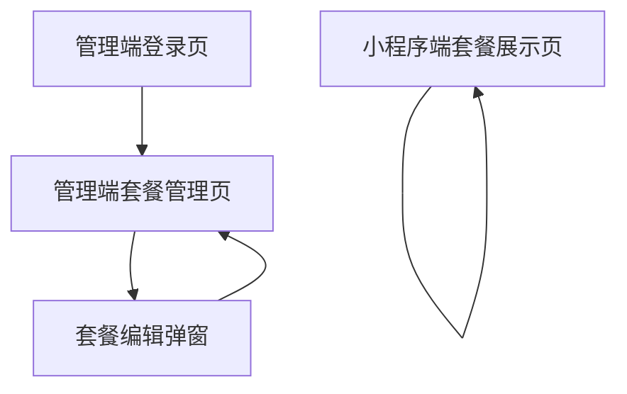

## 1. Product Overview
为管理端套餐增加“封面/媒体”上传能力，并为套餐选项项增加“资源”上传能力；小程序端可稳定展示并适配这些资源。
主要解决：运营配置素材分散、展示不一致、编辑弹窗难用的问题，提升配置效率与转化展示质量。

## 2. Core Features

### 2.1 User Roles
| 角色 | 注册/登录方式 | 核心权限 |
|------|--------------|----------|
| 管理员/运营 | 管理端账号登录 | 管理套餐与选项；上传/替换/删除资源；发布生效 |
| 小程序用户 | 小程序访问（可匿名或登录，按现有机制） | 浏览套餐与资源；查看不同选项对应资源 |

### 2.2 Feature Module
产品由以下核心页面组成：
1. **管理端登录页**：账号登录、登录态保持、退出登录。
2. **管理端套餐管理页（含编辑弹窗）**：套餐列表与搜索；新建/编辑套餐；上传封面与媒体；选项项资源上传；弹窗可滚动且易退出。
3. **小程序端套餐展示页（列表/详情按现有入口）**：展示封面与媒体；展示选项项资源；不同屏幕适配与加载状态。

### 2.3 Page Details
| Page Name | Module Name | Feature description |
|-----------|-------------|---------------------|
| 管理端登录页 | 登录表单 | 输入账号/密码并登录；显示错误提示；支持回车提交 |
| 管理端登录页 | 登录态 | 记住登录态并自动跳转；支持退出登录 |
| 管理端套餐管理页 | 套餐列表 | 浏览套餐列表；搜索/筛选（按现有字段）；进入编辑 |
| 管理端套餐管理页 | 套餐编辑弹窗-基础信息 | 编辑套餐核心字段（按现有字段）；保存/取消 |
| 管理端套餐管理页 | 套餐编辑弹窗-封面上传 | 上传/替换/删除封面；预览封面；校验格式/大小；保存后生效 |
| 管理端套餐管理页 | 套餐编辑弹窗-媒体上传 | 上传多媒体资源（图片/视频/文件，按产品定义）；支持多选、排序、删除、预览；展示上传进度与失败重试 |
| 管理端套餐管理页 | 套餐编辑弹窗-选项项资源上传 | 在每个选项项下上传/替换/删除资源；支持预览与进度；保存后与选项项绑定 |
| 管理端套餐管理页 | 弹窗可滚动 | 弹窗内容区可上下滚动；头部操作区固定（保存/取消/关闭） |
| 管理端套餐管理页 | 弹窗易退出 | 右上角关闭；Esc 关闭；点击遮罩关闭（可配置是否二次确认）；未保存变更时提示确认 |
| 小程序端套餐展示页 | 套餐资源展示 | 展示封面、媒体列表（轮播/网格）；支持图片预览、视频播放、文件下载/打开（按小程序能力） |
| 小程序端套餐展示页 | 选项项资源展示 | 随选项切换展示对应资源；无资源时显示占位与文案 |
| 小程序端套餐展示页 | 适配与状态 | 适配不同屏幕与横竖图；加载中骨架/占位；资源加载失败提示并可重试 |

## 3. Core Process
- 管理员/运营流程：登录管理端 → 进入套餐管理 → 打开某套餐“编辑弹窗” → 上传/替换封面 → 上传/管理套餐媒体（排序/预览/删除）→ 在各选项项下上传资源 → 保存 → 关闭弹窗。
- 小程序用户流程：从小程序入口进入套餐展示 → 查看封面与媒体 → 切换不同选项项 → 浏览对应资源（预览/播放/下载）→ 返回。

