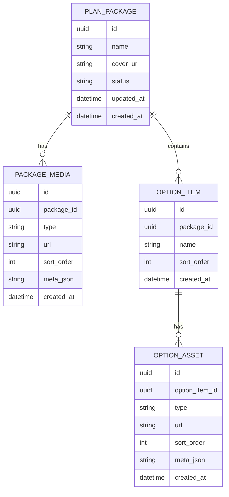

## 1.Architecture design

```mermaid
CREATE TABLE plan_packages (
  id UUID PRIMARY KEY DEFAULT gen_random_uuid(),
  name TEXT NOT NULL,
  cover_url TEXT,
  status TEXT DEFAULT 'draft',
  created_at TIMESTAMPTZ DEFAULT NOW(),
  updated_at TIMESTAMPTZ DEFAULT NOW()
);

GRANT SELECT ON plan_packages TO anon;
GRANT ALL PRIVILEGES ON plan_packages TO authenticated;
```

## 2.Technology Description

* Frontend (Admin Web): React\@18 + vite + tailwindcss\@3（弹窗与上传组件可用 Headless UI / 自研）

* Frontend (Mini Program): 微信小程序原生/框架（按现有项目）

* Backend: Supabase（Auth + PostgreSQL + Storage）

## 3.Route definitions

| Route            | Purpose                |
| ---------------- | ---------------------- |
| /admin/login     | 管理端登录                  |
| /admin/packages  | 套餐列表与进入编辑弹窗            |
| /mp/packages/:id | 小程序端套餐展示（列表/详情按现有路由映射） |

## 6.Data model(if applicable)

### 6.1 Data model definition



### 6.2 Data Definition Language

Package Table (plan\_packages)

```sql
CREATE TABLE plan_packages (
  id UUID PRIMARY KEY DEFAULT gen_random_uuid(),
  name TEXT NOT NULL,
  cover_url TEXT,
  status TEXT DEFAULT 'draft',
  created_at TIMESTAMPTZ DEFAULT NOW(),
  updated_at TIMESTAMPTZ DEFAULT NOW()
);

GRANT SELECT ON plan_packages TO anon;
GRANT ALL PRIVILEGES ON plan_packages TO authenticated;
```

Package Media Table (package\_media)

```sql
CREATE TABLE package_media (
  id UUID PRIMARY KEY DEFAULT gen_random_uuid(),
  package_id UUID NOT NULL,
  type TEXT NOT NULL, -- image/video/file
  url TEXT NOT NULL,
  sort_order INT DEFAULT 0,
  meta_json JSONB DEFAULT '{}'::jsonb,
  created_at TIMESTAMPTZ DEFAULT NOW()
);

CREATE INDEX idx_package_media_package_id ON package_media(package_id);

GRANT SELECT ON package_media TO anon;
GRANT ALL PRIVILEGES ON package_media TO authenticated;
```

Option Item Table (option\_items)

```sql
CREATE TABLE option_items (
  id UUID PRIMARY KEY DEFAULT gen_random_uuid(),
  package_id UUID NOT NULL,
  name TEXT NOT NULL,
  sort_order INT DEFAULT 0,
  created_at TIMESTAMPTZ DEFAULT NOW()
);

CREATE INDEX idx_option_items_package_id ON option_items(package_id);

GRANT SELECT ON option_items TO anon;
GRANT ALL PRIVILEGES ON option_items TO authenticated;
```

Option Asset Table (option\_assets)

```sql
graph TD
  A["管理端浏览器"] --> B["React 管理端前端"]
  C["小程序客户端"] --> D["小程序前端"]
  B --> E["Supabase SDK"]
  D --> E
  E --> F["Supabase Service"]

  subgraph "Frontend Layer"
    B
    D
  end

  subgraph "Service Layer (Provided by Supabase)"
    F
  end
```

Storage（资源文件）建议

* Bucket: package-assets

* 路径规范：packages/{packageId}/cover/*、packages/{packageId}/media/*、options/{optionItemId}/\*

* 访问策略：小程序端以“公开可读 URL”展示（或按现有鉴权策略改为签名 URL；如需签名 URL，再引入服务端签名接口）

