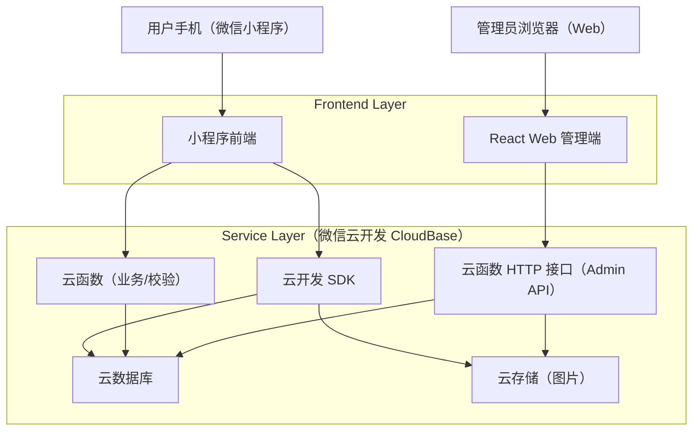
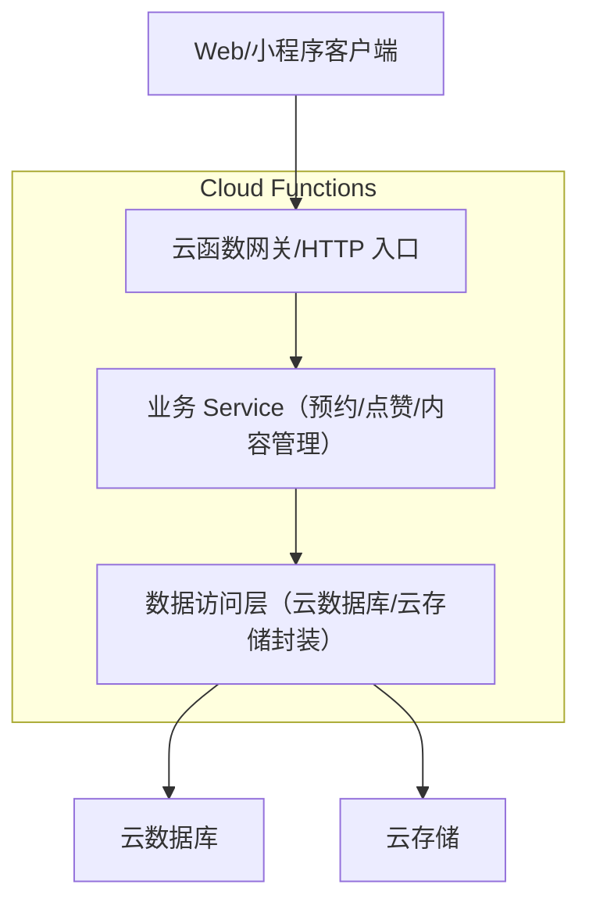
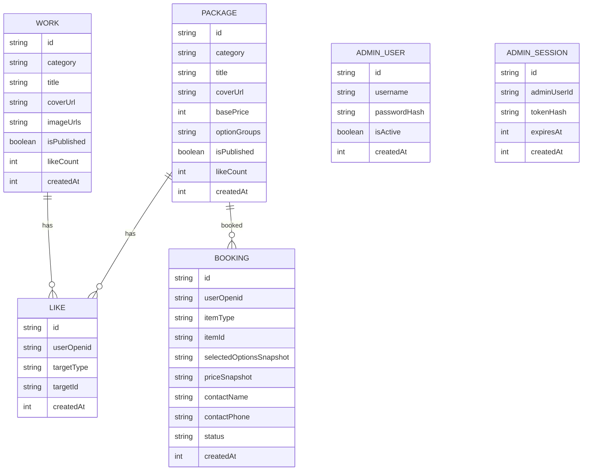

## 1.Architecture design


## 2.Technology Description
- 小程序端：微信小程序（原生小程序框架） + 微信云开发 SDK
- Web 管理端：React@18 + TypeScript + Vite（桌面端优先）
- Backend：微信云开发云函数（Node.js 运行时，提供业务函数与 Admin HTTP API）
- 数据：微信云开发云数据库（集合） + 云存储（作品图片/封面）

## 3.Route definitions
| Route | Purpose |
|-------|---------|
| 小程序：/pages/home/index | 分类入口 + 作品/套餐列表 + 筛选排序 + 快速点赞 |
| 小程序：/pages/detail/index?id= | 作品/套餐详情 + 选项计价 + 预约提交 + 点赞 |
| 小程序：/pages/me/bookings | 我的预约列表与详情入口 |
| Web：/login | 管理员账号密码登录 |
| Web：/admin | 控制台首页（导航到作品/套餐/预约） |
| Web：/admin/works | 作品管理 |
| Web：/admin/packages | 套餐与选项管理 |
| Web：/admin/bookings | 预约管理 |

## 4.API definitions (If it includes backend services)
### 4.1 Admin API（云函数 HTTP）
管理员登录
```
POST /api/admin/login
```
Request:
| Param Name| Param Type | isRequired | Description |
|---|---|---|---|
| username | string | true | 管理员账号 |
| password | string | true | 管理员密码 |

Response:
| Param Name| Param Type | Description |
|---|---|---|
| token | string | 登录态 token（建议 JWT） |
| expiresIn | number | 过期秒数 |

内容管理（示例）
```
GET /api/admin/works
POST /api/admin/works
PUT /api/admin/works/:id
GET /api/admin/bookings
PUT /api/admin/bookings/:id/status
```

### 4.2 Shared TypeScript Types（前后端共用）
```ts
type Category = '毕业照' | '写真照' | '婚纱照' | '场地租赁'

type ItemType = 'work' | 'package'

type PriceOp = 'replace' | 'add' | 'minus'

type PackageOptionItem = {
  id: string
  name: string
  op: PriceOp
  deltaPrice: number // 加价/减价金额；replace 可为 0，仅用于替换内容
  maxQty?: number
}

type PackageOptionGroup = {
  id: string
  name: string
  op: PriceOp
  required: boolean
  selectMode: 'single' | 'multi'
  items: PackageOptionItem[]
}

type Work = {
  id: string
  category: Category
  title: string
  coverUrl: string
  imageUrls: string[]
  description?: string
  isPublished: boolean
  likeCount: number
  createdAt: number
}

type Package = {
  id: string
  category: Category
  title: string
  coverUrl: string
  basePrice: number
  description?: string
  deliverables?: string
  optionGroups: PackageOptionGroup[]
  isPublished: boolean
  likeCount: number
  createdAt: number
}

type BookingStatus = '待确认' | '已确认' | '已完成' | '已取消'

type Booking = {
  id: string
  userOpenid: string
  itemType: ItemType
  itemId: string
  itemTitleSnapshot: string
  selectedOptionsSnapshot?: any
  priceSnapshot?: { base: number; delta: number; total: number; lines: { name: string; delta: number }[] }
  contactName: string
  contactPhone: string
 预约时间: string
  location?: string
  remark?: string
  status: BookingStatus
  adminNote?: string
  createdAt: number
}
```

## 5.Server architecture diagram (If it includes backend services)


## 6.Data model(if applicable)
### 6.1 Data model definition


### 6.2 Data Definition Language
由于微信云开发使用“集合（NoSQL）”，此处提供集合字段规范与索引建议：
- works：{ category, title, coverUrl, imageUrls[], isPublished, likeCount, createdAt }
  - 索引：category + isPublished + createdAt（用于列表分页）；likeCount（用于最热）
- packages：{ category, title, coverUrl, basePrice, optionGroups[], isPublished, likeCount, createdAt }
  - 索引：category + isPublished + createdAt；likeCount
- likes：{ userOpenid, targetType, targetId, createdAt }
  - 唯一约束（逻辑）：userOpenid + targetType + targetId（用于去重点赞）
- bookings：{ userOpenid, itemType, itemId, selectedOptionsSnapshot, priceSnapshot, contact*, status, createdAt }
  - 索引：userOpenid + createdAt（我的预约）；status + createdAt（后台处理）
- admin_users：{ username, passwordHash, isActive, createdAt }
  - 约束（逻辑）：username 唯一
- admin_sessions：{ adminUserId, tokenHash, expiresAt, createdAt }

权限建议（云开发安全规则/云函数校验）：
- 小程序端：公开读取已上架 works/packages；写入 bookings/likes 仅允许当前 openid。
- 管理端：所有写操作与预约状态修改仅允许管理员 token 通过云函数校验后执行。
